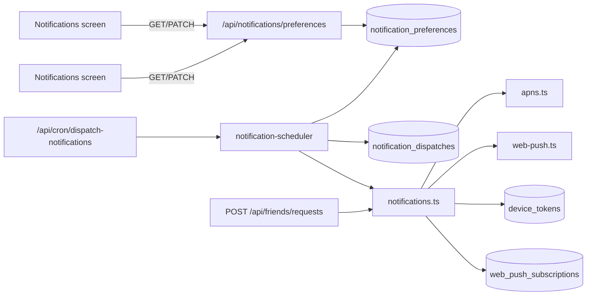

# Notifications

Still Point delivers remote push notifications via **APNs** (iOS) and **Web Push** (browser). User-facing schedules and opt-in live in `notification_preferences`; the server dispatches scheduled types on a cron and records sends in `notification_dispatches` for idempotency.

## Architecture

## Database

| Table | Purpose |
|-------|---------|
| `notification_preferences` | One row per user: master `push_enabled`, per-type flags, reminder time/frequency, quiet hours, IANA `tz`, `friend_request_notifications_enabled` |
| `notification_dispatches` | Unique `(user_id, notification_type, window_key)` — claim before send so cron retries do not double-send |
| `web_push_subscriptions` | Browser push endpoints (#347) |

Migrations: `drizzle/notification_preferences_345_incremental.sql`, `drizzle/web_push_subscriptions_347_incremental.sql`, `drizzle/notification_preferences_friend_request_359_incremental.sql`.

## API

### `GET /api/notifications/preferences`

Returns defaults (created on first read) for the authenticated user.

### `PATCH /api/notifications/preferences`

Partial update. Supported fields:

- `pushEnabled`, `dailyReminderEnabled`, `missADayEnabled`, `friendRequestNotificationsEnabled` (boolean)
- `dailyReminderTime`, `quietHoursStart`, `quietHoursEnd` (`HH:MM` 24h; quiet hours nullable)
- `dailyReminderFrequency`: `daily` | `every_other` | `weekly`
- `tz`: IANA timezone string

Quiet hours: `quietHoursStart` and `quietHoursEnd` must be updated together (or both set to `null`).

### Web Push device registration

- `GET /api/notifications/push/subscription` — VAPID public key
- `POST|DELETE /api/notifications/push/subscription` — register/unregister browser subscription

### iOS device registration

`POST|DELETE /api/device-token` (unchanged from #203).

## Notification types

| Type | `notification_type` | Trigger | Preference gate |
|------|----------------------|---------|-----------------|
| Daily practice reminder | `daily_reminder` | Cron | `pushEnabled` + `dailyReminderEnabled` + quiet hours + frequency + tz |
| Miss a day | `miss_a_day` | Cron (at daily reminder window) | `pushEnabled` + `missADayEnabled` |
| Friend request | `friend_request` | `POST /api/friends/requests` | `pushEnabled` + `friendRequestNotificationsEnabled` |

## Scheduler

- **Route:** `GET|POST /api/cron/dispatch-notifications`
- **Schedule:** every 5 minutes (`vercel.json` crons)
- **Auth:** `Authorization: Bearer $CRON_SECRET` (required in production)
- **Window:** matches users whose local reminder time falls within the last 5 minutes
- **Quiet hours:** skipped when local time is inside the configured range (overnight ranges supported)
- **Miss a day:** at most one per local day when the user did not complete a session yesterday or today; uses the same cron window as the daily reminder
- **Frequency:** `daily` = one send per local date; `every_other` = even day index; `weekly` = Mondays (local)

## Settings UI (#359)

- **iOS:** Settings → **Notifications** (`NavigationLink` → `NotificationsSettingsView`)
- **Web:** Settings → **Notifications** → `/app/settings/notifications`

Section order (parity): Push on this device → Daily practice reminder → Quiet hours → Miss a day → Friend activity.

Master push off disables dependent controls in the UI and persists `pushEnabled: false` (and unsubscribes web push / disables iOS token as before).

## Adding a notification type

1. **Preference flag** — Add a boolean column on `notification_preferences` (migration + schema + PATCH validation).
2. **Send helper** — Add `sendXNotification()` in `src/lib/notifications.ts` (APNs + `sendWebPushToUser` where applicable).
3. **Scheduler branch** — In `src/lib/notification-scheduler.ts` for scheduled types, or event handler for instant types.
4. **iOS + web** — Expose the flag on the Notifications screen; handle payload `type` on tap.
5. **Tests** — Preference validation, scheduler gating, idempotent `claimNotificationDispatch`.

## Security

- Never log raw APNs device tokens or Web Push subscription keys.
- Cron endpoint must not be callable without `CRON_SECRET` in production.

## Related issues

- #203 — APNs + `device_tokens`
- #345 — Preferences foundation
- #346 — Daily reminder
- #347 — Web Push channel
- #359 — Unified Notifications settings screen
