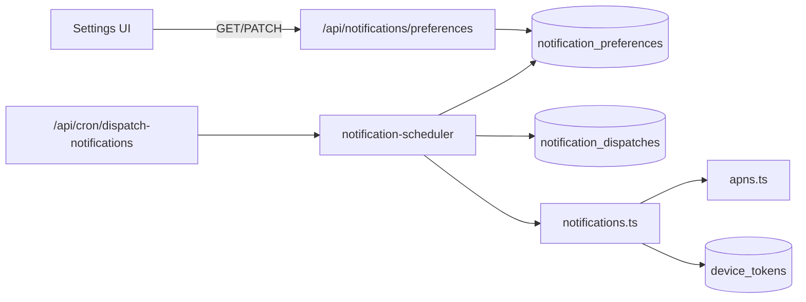

# Notifications

Still Point delivers remote push notifications via APNs. User-facing schedules and opt-in live in `notification_preferences`; the server dispatches on a cron and records sends in `notification_dispatches` for idempotency.

## Architecture

## Database

| Table | Purpose |
|-------|---------|
| `notification_preferences` | One row per user: master `push_enabled`, per-type flags, reminder time/frequency, quiet hours, IANA `tz` |
| `notification_dispatches` | Unique `(user_id, notification_type, window_key)` — claim before send so cron retries do not double-send |

Apply schema with `npm run db:migrate` (incremental SQL: `drizzle/notification_preferences_345_incremental.sql`).

## API

### `GET /api/notifications/preferences`

Returns defaults (created on first read) for the authenticated user.

### `PATCH /api/notifications/preferences`

Partial update. Supported fields:

- `pushEnabled`, `dailyReminderEnabled`, `missADayEnabled` (boolean)
- `dailyReminderTime`, `quietHoursStart`, `quietHoursEnd` (`HH:MM` 24h; quiet hours nullable)
- `dailyReminderFrequency`: `daily` | `every_other` | `weekly`
- `tz`: IANA timezone string

## Scheduler

- **Route:** `GET|POST /api/cron/dispatch-notifications`
- **Schedule:** every 5 minutes (`vercel.json` crons)
- **Auth:** `Authorization: Bearer $CRON_SECRET` (required in production)
- **Window:** matches users whose local reminder time falls within the last 5 minutes (including windows that cross local midnight)
- **Quiet hours:** skipped when local time is inside the configured range (overnight ranges supported)
- **Frequency:** `daily` = one send per local date; `every_other` = even day index; `weekly` = Mondays (local)
- **One push per local calendar day:** before sending, the scheduler checks `notification_dispatches` for any row with `window_key` equal to the user's local `YYYY-MM-DD`. Miss-a-day and daily reminder share this cap when frequency is `daily`.

## Notification types

| Type | Issue | Deep link | Precedence |
|------|-------|-----------|------------|
| `miss_a_day` | #247 | `stillpoint://session/quick` | Wins over daily reminder when yesterday was missed |
| `daily_reminder` | #346 | `stillpoint://session` | Default when miss-a-day does not apply |

### Miss-a-day (#247)

- Gated by: `push_enabled` && `miss_a_day_enabled`
- Fires in the user's daily reminder window when they have **not** completed a session today and **did not** complete one yesterday (local dates)
- Uses `window_key` = local `YYYY-MM-DD` and type `miss_a_day`
- Helper: `sendMissADayNotification`

### Daily reminder (#346)

- Type: `daily_reminder`
- Window key: local `YYYY-MM-DD` (or `YYYY-Www` for weekly frequency)
- Helper: `sendDailyReminderNotification`
- Gated by: `push_enabled` && `daily_reminder_enabled`

## Adding a notification type

1. **Preference flag** — Add a boolean column on `notification_preferences` (migration + schema + PATCH validation).
2. **Send helper** — Add `sendXNotification()` in `src/lib/notifications.ts` using `sendPushNotificationToUser` with a distinct `type` in the payload.
3. **Scheduler branch** — In `src/lib/notification-scheduler.ts`, select eligible users, compute a stable `window_key`, call `claimNotificationDispatch`, then the send helper. Roll back the dispatch row if APNs delivery fails.
4. **iOS** — Expose the flag in Settings (PATCH preferences) and handle the payload `type` / `deepLink` when the user taps the notification.
5. **Tests** — Unit tests for preference validation, scheduler gating, and idempotent `claimNotificationDispatch`.

## iOS

- Settings → **NOTIFICATIONS**: master push toggle (triggers system permission on first opt-in), daily reminder toggle, miss-a-day toggle, time picker, frequency picker, quiet hours.
- `PushNotificationCoordinator.requestAuthorizationAndRegister()` runs when the user enables push; login only re-registers the device token if permission was already granted.
- Tap handling: `PushNotificationCoordinator` stores pending deep links; `AppViewModel.consumePendingSessionDeepLinkIfNeeded()` opens `stillpoint://session` or `stillpoint://session/quick`.
- Device tokens: `POST|DELETE /api/device-token` (unchanged from #203).

## Security

- Never log raw APNs device tokens.
- Cron endpoint must not be callable without `CRON_SECRET` in production.

## Related issues

- #203 — APNs + `device_tokens`
- #345 — Notification preferences foundation
- #346 — Daily reminder
- #247 — Miss-a-day notifications
