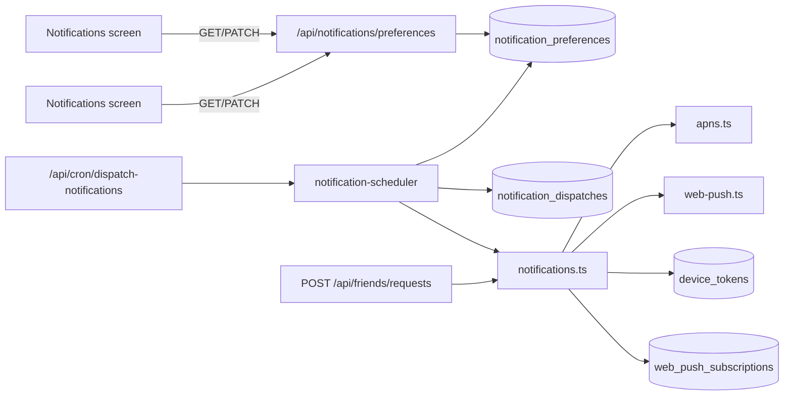

# Notifications

Still Point delivers remote push notifications via **APNs** (iOS) and **Web Push** (browser). User-facing schedules and opt-in live in `notification_preferences`; the server dispatches scheduled types on a cron and records sends in `notification_dispatches` for idempotency.

## Architecture

## Database

| Table | Purpose |
|-------|---------|
| `notification_preferences` | One row per user: master `push_enabled`, per-type flags, reminder time/frequency, quiet hours, missed-sit call opt-in (`call_opt_in`, `call_phone_number`, `call_consent_at`, `call_window_start`, `call_window_stop`), IANA `tz`, `friend_request_notifications_enabled`, `suppress_during_session` |
| `notification_dispatches` | Unique `(user_id, notification_type, window_key)` — claim before send so cron retries do not double-send |
| `call_attempts` | Outbound missed-sit Vapi call log (#599): phone, window key, status, optional `vapi_call_id` |
| `web_push_subscriptions` | Browser push endpoints (#347) |

Migrations: `drizzle/notification_preferences_345_incremental.sql`, `drizzle/web_push_subscriptions_347_incremental.sql`, `drizzle/notification_preferences_friend_request_359_incremental.sql`, `drizzle/notification_preferences_suppress_during_session_431_incremental.sql`, `drizzle/notification_preferences_dispatch_idx_531_incremental.sql`, `drizzle/notification_preferences_call_window_599_incremental.sql`, `drizzle/call_attempts_599_incremental.sql`.

## API

### `GET /api/notifications/preferences`

Returns defaults (created on first read) for the authenticated user.

### `PATCH /api/notifications/preferences`

Partial update. Supported fields:

- `pushEnabled`, `dailyReminderEnabled`, `missADayEnabled`, `friendRequestNotificationsEnabled`, `suppressDuringSession`, `callOptIn` (boolean)
- `callPhoneNumber` (E.164, e.g. `+15551234567`), `callWindowStart`, `callWindowStop` (`HH:MM` 24h; window fields nullable)
- `dailyReminderTime`, `quietHoursStart`, `quietHoursEnd` (`HH:MM` 24h; quiet hours nullable)
- `dailyReminderFrequency`: `daily` | `every_other` | `weekly`
- `tz`: IANA timezone string

Quiet hours: `quietHoursStart` and `quietHoursEnd` must be updated together (or both set to `null`).

Call opt-in: `callOptIn: true` requires `callPhoneNumber` plus `callWindowStart` and `callWindowStop` (updated together). Consent timestamp `callConsentAt` is set on opt-in and cleared on opt-out. Call window fields must differ (`start !== stop`).

### Web Push device registration

- `GET /api/notifications/push/subscription` — VAPID public key
- `POST|DELETE /api/notifications/push/subscription` — register/unregister browser subscription

### iOS device registration

`POST|DELETE /api/device-token` (unchanged from #203).

## Configuration

The dispatcher needs provider credentials **in every environment that runs the cron** (Production, and any Preview that dispatches). APNs requires all four of `APNS_BUNDLE_ID`, `APNS_TEAM_ID`, `APNS_KEY_ID`, `APNS_PRIVATE_KEY`; Web Push requires the `WEB_PUSH_VAPID_*` set. Missing any APNs var makes `getApnsConfig()` throw before a request reaches Apple.

Because a thrown provider-config error is caught per-token and never re-raised, a misconfigured environment fails **silently** — the cron still returns `200 {ok:true, sent:0}`. That left every scheduled iOS push undelivered for weeks (#621: `APNS_BUNDLE_ID` was simply unset in Production). Two guards now make that state visible:

- `getApnsConfigStatus()` (`src/lib/apns.ts`) is a non-throwing presence check. `sendPushNotificationToUser` preflights it and, when unconfigured, logs one actionable line naming the missing vars and skips the send — the device token is left enabled (a config error is not an APNs rejection).
- `/api/cron/dispatch-notifications` returns `apnsConfigured` (and `apnsMissing` when false) in its JSON, so the config state is visible at a glance instead of hidden behind a 200.

## Notification types

| Type | Issue | `notification_type` | Deep link (iOS) | Preference gate |
|------|-------|---------------------|-----------------|-----------------|
| Miss a day | #247 | `miss_a_day` | `stillpoint://session/quick` | `pushEnabled` + `missADayEnabled` |
| Daily practice reminder | #346 | `daily_reminder` | `stillpoint://home` | `pushEnabled` + `dailyReminderEnabled` + quiet hours + frequency |
| Friend request | #359 | `friend_request` | `stillpoint://home` | `pushEnabled` + `friendRequestNotificationsEnabled` |
| Failure-reason reminder | #441 | `failure_reason_reminder` | `stillpoint://log-reason?date=YYYY-MM-DD` | `pushEnabled` + `failureReasonReminderEnabled` |
| Missed-sit phone call | #599 | `missed_sit_call` | _(outbound Vapi call — no push)_ | `callOptIn` + phone + `[callWindowStart, callWindowStop]` |

Miss-a-day wins over daily reminder when both would fire in the same cron window (user missed yesterday and has not sat today).

### Missed-sit phone call (#599)

- Opt-in off by default; requires E.164 phone + local call window `[X, Y]`
- Hourly outbound Vapi calls from X through Y while the user has not completed a qualifying sit that local day
- Completing any qualifying sit cancels remaining calls for that day
- Idempotency `window_key` = `{localDate}T{hour}` (hour-granular, e.g. `2026-05-29T18`)
- Attempts logged in `call_attempts`; Vapi env vars (`VAPI_API_KEY`, `VAPI_ASSISTANT_ID`, `VAPI_PHONE_NUMBER_ID`) required for live calls only

### Miss-a-day (#247)

- Fires in the user's daily reminder window when they have **not** completed a session today and **did not** complete one yesterday (local dates)
- Uses `window_key` = local `YYYY-MM-DD` and type `miss_a_day`
- Helper: `sendMissADayNotification` (APNs + Web Push)

### Daily reminder (#346)

- Window key: local `YYYY-MM-DD` (or `YYYY-Www` for weekly frequency)
- Helper: `sendDailyReminderNotification` (streak-aware copy + APNs/Web Push)
- Skipped when user already completed a session today, or a `miss_a_day` dispatch exists for the same local date

### Friend request (#359)

- Event-driven on `POST /api/friends/requests`
- Helper: `sendFriendRequestNotification` (APNs + Web Push)

### Failure-reason reminder (#441)

- Fixed **8 PM local** trigger, independent of `dailyReminderTime`
- Helper: `sendFailureReasonReminderNotification` (yesterday-first catch-up framing)
- Deep link: `/app/log-reason?date=…` (web) / `stillpoint://log-reason?date=…` (iOS)
- Idempotency `window_key` = local firing date (not the day being asked about)
- Skipped when user completed a session or logged a failure reason for the target day

## Suppress during session (#431)

Opt-in (`suppress_during_session`, default false) that holds push **display** on
the user's devices while a sit is in progress. The server still *sends* pushes
normally; suppression happens client-side per platform, and the pref is synced so
the choice carries across devices.

- **Web:** `SessionView` relays the desired state (`prefOn && sessionActive`) to
  the service worker over a `BroadcastChannel`
  (`stillpoint-session-suppression`). `public/sw.js` keeps the latest flag
  (also persisted in Cache Storage so a push that cold-starts the worker still
  honors it) and skips `showNotification` while suppression is active. The pref
  is mirrored from the server row into `localStorage`
  (`src/lib/sessionSuppressionPrefs.ts`) so the in-progress page can read it
  without a network round-trip — the same pattern as the wake-lock pref (#317).
  - *Tradeoff:* the Push API mandates `userVisibleOnly`, so a browser may
    eventually show a generic background notice or trim the push budget if many
    pushes are dropped silently. Suppression is opt-in and scoped to the short
    window of an active sit, keeping that risk low.
- **iOS:** `SessionNotificationSuppressionController` tracks the cached opt-in
  plus local/buddy session-active state (parity with `SessionIdleTimerController`).
  `PushNotificationCoordinator.willPresent` returns empty presentation options
  (no banner/sound) when a sit is in progress and the opt-in is on. The opt-in is
  cached in `UserDefaults` so `willPresent` works before the Notifications screen
  is opened.

A paused sit still counts as "in session" on both platforms, so reminders stay
held until the sit truly completes or is abandoned.

## Scheduler

- **Route:** `GET|POST /api/cron/dispatch-notifications`
- **Schedule:** every 5 minutes (`vercel.json` crons)
- **Auth:** `Authorization: Bearer $CRON_SECRET` (required in production)
- **Window:** matches users whose local reminder time falls within the last 5 minutes (including windows that cross local midnight)
- **Quiet hours:** skipped when local time is inside the configured range (overnight ranges supported)
- **Frequency:** `daily` = one send per local date; `every_other` = even day index; `weekly` = Mondays (local)
- **Dedup:** `claimNotificationDispatch` is the source of truth per `(user_id, notification_type, window_key)`
- **Missed-sit calls:** separate candidate query for `call_opt_in` users; cron JSON includes `callsInitiated` and `callCandidatesScanned`
- **DST spring-forward gap (#531):** reminders scheduled inside the skipped local hour on spring-forward night (e.g. 02:30 `America/New_York`) are not delivered — cron ticks land at 01:55 then 03:00, both outside the 5-minute window. This is a once-per-year-per-timezone edge case; no catch-up pass is implemented yet.

## Settings UI (#359)

- **iOS:** Settings → **Notifications** (`NavigationLink` → `NotificationsSettingsView`)
- **Web:** Settings → **Notifications** → `/app/settings/notifications`

Section order (parity): Push on this device → Daily practice reminder → Quiet hours → Missed-sit phone call → Miss a day → Friend activity → During sessions.

Master push off disables dependent controls in the UI and persists `pushEnabled: false` (and unsubscribes web push / disables iOS token as before). Other preference toggles are preserved while push is off.

## iOS tap handling

- `PushNotificationCoordinator` stores pending deep links until `RootView` wires handlers
- `stillpoint://home` → home
- `stillpoint://session` / `stillpoint://session/quick` → `AppViewModel.consumePendingSessionDeepLinkIfNeeded()`
- `stillpoint://log-reason?date=…` → native log-reason capture (`LogReasonView`)
- `stillpoint://friends` → friends surface (via notification deep-link handler)

## Adding a notification type

1. **Preference flag** — Add a boolean column on `notification_preferences` (migration + schema + PATCH validation).
2. **Send helper** — Add `sendXNotification()` in `src/lib/notifications.ts` (APNs + `sendWebPushToUser` where applicable).
3. **Scheduler branch** — In `src/lib/notification-scheduler.ts` for scheduled types, or event handler for instant types. Roll back the dispatch row if delivery fails.
4. **iOS + web** — Expose the flag on the Notifications screen; handle payload `type` / `deepLink` on tap.
5. **Tests** — Preference validation, scheduler gating, idempotent `claimNotificationDispatch`.

## Security

- Never log raw APNs device tokens or Web Push subscription keys.
- Cron endpoint must not be callable without `CRON_SECRET` in production.

## Related issues

- #203 — APNs + `device_tokens`
- #345 — Notification preferences foundation
- #346 — Daily reminder
- #347 — Web Push channel
- #247 — Miss-a-day notifications
- #359 — Unified Notifications settings screen
- #431 — Suppress notifications during a meditation session
- #599 — Missed-sit outbound Vapi phone calls
